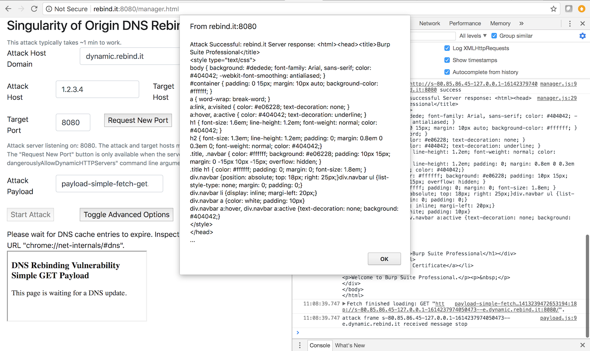

# Singularity of Origin

## Table of Contents
<!-- TOC depthFrom:2 depthTo:6 withLinks:1 updateOnSave:1 orderedList:0 -->
- [Table of Contents](#table-of-contents)
- [Introduction](#introduction)
- [Features](#features)
- [Screenshots](#screenshots)
- [Requirements](#requirements)
- [Setup](#setup)
  - [On the DNS Registrar Web Management Interface](#on-the-dns-registrar-web-management-interface)
  - [On the Attacker Host](#on-the-attacker-host)
- [Test](#test)
- [Browser Support](#browser-support)
- [Using Singularity](#using-singularity)
- [Preventing DNS Rebinding Attacks](#preventing-dns-rebinding-attacks)
- [Advanced Techniques](#advanced-techniques)
- [Useful Notes and Other Loose Ends](#useful-notes-and-other-loose-ends)
- [Contributing](#contributing)
- [Credits](#credits)
- [Disclaimer](#disclaimer)

<!-- /TOC -->

## Introducing Singularity

`Singularity of Origin` is a tool to perform [DNS rebinding](https://en.wikipedia.org/wiki/DNS_rebinding) attacks. It includes the necessary components to rebind the IP address of the attack server DNS name to the target machine's IP address and to serve attack payloads to exploit vulnerable software on the target machine. 

It also ships with sample payloads to exploit several vulnerable software versions, from the simple capture of a home page to performing remote code execution. It aims at providing a framework to facilitate the exploitation of software vulnerable to DNS rebinding attacks and to raise awareness on how they work and how to protect from them.

### How Do DNS Rebinding Attacks Work?
DNS rebinding changes the IP address of an attacker controlled machine name to the IP address of a target application, bypassing the [same-origin policy](https://developer.mozilla.org/en-US/docs/Web/Security/Same-origin_policy) and thus allowing the browser to make arbitrary requests to the target application and read their responses. 
The Singularity DNS server is responding with short time to live (TTL) records,
minimizing the time the response is cached.
When the victim browses to the Singularity manager interface, the Singularity's
DNS server first responds with the IP address of Singularity itself where the
client-side code (payload) is hosted.
When the DNS record times out, the Singularity DNS server responds with the IP
address of the target host (e.g. 127.0.0.1) and the victim's browser can access
the target application, circumventing the browser's same-origin policy.

It is also possible to trigger DNS rebinding before a cached DNS record expires, depending of the target platform and using a combination of techniques that are described in later sections.


## Features

* Singularity provides a complete DNS rebinding attack delivery stack:
  * Custom DNS server to rebind DNS name and IP address mapping from the attacker web server address to the target machine address
  * HTTP server to serve HTML pages and JavaScript code to targets and to manage the attacks
  * Several sample attack payloads, ranging from grabbing the home page of a target application to performing remote code execution. These payloads can be easily adapted to perform new and custom attacks.
* Supports concurrent users.
* Provides several DNS rebinding strategies, including sequential mapping from the attacker to the target IP address and random mapping, to minimize the impact of IDS/IPS interfering with the attack.
* A number of technical controls to maximize the reliability and speed of attacks:
  * Disabling HTTP keep alive, caching, DNS prefetching
  * Aggressive DNS response TTLs
  * Option to use DNS CNAME instead of A records to evade several DNS filtering solutions or to target internal resources for which the IP address is unknown.
  * Near instant rebinding for several browser and OS combinations, using multiple DNS answers and dynamic HTTP port blocking.
* Ability to allocate HTTP servers at startup or dynamically thereafter
  * A convenience feature to avoid restarting Singularity to listen on a different HTTP port.
  * To lay the ground work to attack vulnerable ports discovered after a scan.
* Permits using target web browsers as HTTP proxies to internal network resources, to explore and exploit otherwise inaccessible applications with your own browser or tools such as `curl`.
* A simple, fast and efficient HTTP port scanner to identify vulnerable services.
* Provides both user interface driven and scripted attacks.

## Screenshots

### Singularity Manager Interface


### Fetch a Vulnerable Application Home Page on Localhost


## Requirements

* A DNS domain name from a domain registrar such as [gandi](https://www.gandi.net) or [namecheap](https://www.namecheap.com/). You need be able to add and edit your own DNS records for your domain.
* A Linux server instance from a hosting provider such as [Linode](https://www.linode.com/), [Amazon AWS](https://aws.amazon.com/ec2/), [Google Cloud](https://cloud.google.com/), [Microsoft Azure](https://azure.microsoft.com/en-us/) etc.

## Setup

Let's say that we want to retrieve the homepage of a tool listening on `localhost`, port 8080, of a victim desktop machine from domain "*dynamic.your.domain.*" You personally own/manage domain "*your.domain.*" You will mount attacks from a server with IP address "*ip.ad.dr.ss*". This server will run the Singularity DNS and HTTP servers.

### On the DNS Registrar Web Management Interface

Configure appropriate DNS records to delegate the management of a test subdomain ("*dynamic.your.domain.*") of a domain you own ("*your.domain.*") to the Singularity's DNS server that we will deploy shortly:

* **A Name**: "rebinder", **IPv4**: "*ip.ad.dr.ss*"
* **NS Name**: "dynamic", **Hostname**: "*rebinder.your.domain.*"

This sample setup informs DNS clients, including browsers, that "*ip.ad.dr.ss*" answers queries for any subdomains under "*.dynamic.your.domain.*", e.g. "foo.dynamic.your.domain.". This also permits one to access the Singularity management console using the "*rebinder.your.domain*" DNS name with a web browser.


### On the Attacker Host

#### Install Golang
Follow the instructions from the official [Go Programming Language web site](https://golang.org/doc/install).

#### Obtain Singularity

Open a terminal and type the following commands:

```bash
go get -v github.com/nccgroup/singularity
go get -v github.com/gorilla/mux
go get -v github.com/gorilla/websocket
go get -v github.com/gorilla/securecookie
````

#### Compile 

```bash
$ cd ~/go/src/github.com/nccgroup/singularity/cmd/singularity-server
$ go build
````

#### Deploy

 * Deploy the "html" directory in let's say "~/singularity".
 * Deploy the `singularity-server` binary in "~/singularity".

 ```bash
$ cd ~/
$ mkdir -p singularity/html
$ cp ~/go/src/github.com/nccgroup/singularity/cmd/singularity-server/singularity-server ~/singularity/
$ cp ~/go/src/github.com/nccgroup/singularity/html/* ~/singularity/html/
 ```

#### Run
 Start `singularity-server` with `sudo ./singularity-server --HTTPServerPort  8080`. This will use a DNS rebinding strategy based on the content of the DNS query by default e.g. `s-ip.ad.dr.ss-127.0.0.1-<random_number>-fs-e.dynamic.your.domain` will return first  "*ip.ad.dr.ss*", the attacker host IP address, then  "127.0.0.1" for subsequent queries for a limited period of time.

Note: You will need to verify that other services do not listen on ports required by Singularity. 

##### Minimum required ports:

- UDP 53 (DNS)
- TCP 8080 (configurable default port for the manager web interface)
- The port where the vulnerable application is running (e.g. port 3000 for the
  Ruby on Rails Web Console or port 9333 for VS Code Chrome DevTools)

On Ubuntu 18.04 LTS, by default, `systemd-resolved` is listening on the localhost UDP port 53. This will prevent Singularity from starting.
Disable `systemd-resolved` with this command: `sudo systemctl disable --now systemd-resolved.service`.
Next, update the file `/etc/resolv.conf` to make sure it does not contain `nameserver 127.0.0.53` but something like `nameserver 8.8.8.8`.
Replace `8.8.8.8` with the IP address of the DNS server of your choosing (e.g. nameserver 169.254.169.254 on [GCP](https://cloud.google.com/compute/docs/internal-dns)).


#### Firewalls
Singularity requires multiple ports exposed to the Internet (or at least to the
network from which you access the tool via your browser).
The minimum required ports are UDP 53 for DNS and the port where the
Singularity manager web interface is running.
The default port for the manager web interface is TCP port 8080.
Additionally, Singularity requires that the payload is served from the same
port where the vulnerable/exploited application is running on to not violate
the [same-origin policy](https://developer.mozilla.org/en-US/docs/Web/Security/Same-origin_policy).

Minimum required ports are listed [above](#Minimum-required-ports).

Please check with your hosting provider to configure allowed inbound ports:

- [AWS: Authorizing Inbound Traffic for Your Linux Instances](https://docs.aws.amazon.com/AWSEC2/latest/UserGuide/authorizing-access-to-an-instance.html) 
- [GCP: Using Firewall Rules ](https://cloud.google.com/vpc/docs/using-firewalls)

## Test

### On the Victim Host
 * Deploy a local test service with `python -c 'import BaseHTTPServer as bhs, SimpleHTTPServer as shs; bhs.HTTPServer(("127.0.0.1", 8080), shs.SimpleHTTPRequestHandler).serve_forever()'` from a directory containing some test data files, on your client machine.
 * Browse to "http://rebinder.your.domain:8080/manager.html".
 * Ensure that the following fields contain the correct information: 
   * "Attack Host Domain" e.g. "*dynamic.your.domain*"
   * "Attack Host" e.g. "*ip.ad.dr.ss*"
   * "Target Port" e.g. 8080
   * "Attack Payload", "payload-simple-fetch-get.html".
 * Click on "Start Attack".
 * The content of your victim host directory should be displayed within a few seconds/minutes in an alert box.

## Browser Support

Singularity has been tested to work in the following browsers:

| Browser  | Operating System | Time to Exploit |
| --- | --- | --- |
| Firefox | Windows 7 / 10 | ~1 min |
| Chrome  | Windows 7 / 10 | ~1 min |
| Firefox | Ubuntu | ~1 min |
| Chromium | Ubuntu | ~1 min |
| Edge | Windows 10 |  ~21 to ~49 min |
| Firefox | macOS | ~1 min |
| Chrome | macOS | ~1 min |
| Safari | macOS | ~1 min |
| Chrome | Android | ~1 min |
| Firefox | Android | ~1 min |
| Safari | iOS | ~1 min |
| Firefox | iOS | ~1 min |

The above was tested with Singularity's default conservative settings: 
* DNS rebinding strategy: `First then second (default, conservative)`
* Fetch interval (Web interface): 20s
* Target: 127.0.0.1.

Much faster attacks can be achieved in certain configurations, as detailed in the table below:

| Browser  | Operating System | Time to Exploit | Rebinding Strategy | Fetch Interval | Target Specification |
| --- | --- | --- | --- | ---| ---| 
| Chrome  | Windows 10 | ~3s | `Multiple answers (fast)` | 1s | 127.0.0.1 |
| Edge | Windows 10 |  ~3s | `Multiple answers (fast)` | 1s |127.0.0.1 |
| Firefox | Windows 10 | ~3s | `Multiple answers (fast)` | 1s | 127.0.0.1 |
| Chromium | Ubuntu | ~3s | `Multiple answers (fast)` | 1s | 0.0.0.0 |
| Firefox | Ubuntu | ~3s | `Multiple answers (fast)` | 1s | 0.0.0.0 |
| Chrome | macOS | ~3s | `Multiple answers (fast)` | 1s |0.0.0.0 |
| Firefox | macOS |  ~3s | `Multiple answers (fast)` | 1s |0.0.0.0 |
| Safari | macOS |  ~3s | `Multiple answers (fast)` | 1s |0.0.0.0 |

We will add more platforms as we test them. We elected a delay of 3s to perform DNS rebinding to cater for targets with a poor connection to the internet/network.

## Using Singularity
When Singularity is run without arguments, the manager web interface
listens on TCP port 8080.
Browse to that port to configure and launch the DNS rebinding attack.

### Personalizing The Manager Configuration File
Singularity comes with a default configuration file in `html/manager-config.json`.
You can modify this file to change the default parameters, such as  `attackHostDomain`, `attackHostIPAddress` `attackPayloads`, `rebindingStrategy` and `interval`.

Valid DNS rebinding strategy (`"rebindingStrategy"` setting) configuration file values and their corresponding Singularity manager web interface values are as follows:

* `"fs"`: "First then second (default, conservative)"
* `"ma"`: "Multiple answers (fast)"
* `"rr"`: "Round robin (IPS/filters evasion)"
* `"rd"`: "Random (IPS/filters evasion)".

These DNS rebinding strategies are explained in a later section.

You need to edit this file if you add your own payloads.
You do not need to edit the configuration file if you want to use existing
payloads as you can change the parameters in the web interface.

### Server Arguments
Launch the Singularity binary, (`singularity-server`), with the `-h` parameter to see its parameters.

- `-HTTPServerPort value` : 
  Specify the attacker HTTP Server port that will serve HTML/JavaScript files. 
  Repeat this flag to listen on more than one HTTP port.
- `-ResponseIPAddr string` : 
  Specify the attacker host IP address that will be rebound to the victim host 
  address (default value
  is 192.168.0.1).
- `-ResponseReboundIPAddr string` : 
  Specify the victim host IP address that is rebound from the attacker host
  address (default value is 127.0.0.1).
- `-dangerousAllowDynamicHTTPServers`
  Specify if any target can dynamically request Singularity to allocate an HTTP
  Server on a new port.
  This feature may be *dangerous* as it allows opening new ports via the
  unauthenticated web interface.
- `-responseReboundIPAddrtimeOut int` : 
  Specify a delay in seconds for which we will keep responding with Rebound IP
  Address after the last query.
  After the delay, we will respond with `ResponseReboundIPAddr`.
  The default is 300 seconds.
-  `-httpProxyServerPort int` :
  Specify the attacker HTTP Proxy Server port that permits to browse hijacked client services.
  The default is 3129.

### Manager UI
The manager web interface is where you configure and launch the DNS rebinding
attack.
It listens on port 8080 by default.
The following table describes all form fields and buttons in the manager interface:

| Field Name | Description | 
| --- | --- |
| Attack Host Domain | This is the (sub-)domain where the Singularity web server is running. Default value: `dynamic.rebind.it` |
| Attack Host | This is the IP address where the manager and the attack payloads are hosted. Default value: xxx.xxx.xxx.xxx |
| Target Host | This is the IP address or FQDN (e.g. jenkins.internal.target.com) of the target system where the victim (target) application is running. Default value: 127.0.0.1 |
| Target Port | This is the port where the victim (target) application is listening on. Default value: 8080 |
| Request New Port | This will request Singularity to listen on a new port. This feature is only available when Singularity has been started with the `-dangerouslyAllowDynamicHTTPServers` command line option. |
| Attack Payload | This is where you select the payload, i.e. which application you are trying to exploit. |
| Start Attack | Start the DNS rebinding attack. Be patient and wait for at least one minute. Open the browser web console to see debugging logs. |
| Toggle Advanced Options | This button will enable the advanced fields described below. |
| Rebinding Strategy | Specify how to respond to DNS queries from a victim client. The following options are available:<br /><br /> * `First then second (default, conservative)`: This is the default value. It should work on most if not all platforms in 40 to 60 seconds. <br /> * `Multiple answers`: Near instant DNS rebinding attack! Make sure to set the interval option described below to 1 second and the target address if attacking the local host to "0.0.0.0" for Unix-like platforms (e.g. Linux, macOS) and to "127.0.0.1" (or any other valid local host addresses) for Microsoft Windows.<br /> * `Round robin (IPS/filters evasion)`: Alternate DNS responses between the attack  and target host IP addresses.<br /> * `Random (IPS/filters evasion)`: Randomly alternate DNS responses between the attack and target host IP addresses. <br /> |
| Interval | How long to wait between connection attempts to the target application in seconds. Default value: 20 |
| Index Token | The index token is used by Singularity to detect if the rebinding has happened yet. Default value: `thisismytesttoken`. |

### Payloads Description
Singularity supports the following attack payloads:

* **Basic fetch request** (`payload-simple-fetch-get.html`): This sample payload
  makes a GET request to the root directory ('/') and shows the server response
  using the `fetch` API.
  The goal of this payload is to function as example request to make additional
  contributions as easy as possible.
* **Basic XHR request** (`payload-simple-xhr-get.html`): Another sample payload to
  make a GET request to the root directory ('/') and showing the server response
  using `XMLHttpRequest` (XHR).
* **Chrome DevTools** (`payload-exposed-chrome-devtools.html`): This payload
  demonstrates a remote code execution (RCE) vulnerability in Microsoft VS Code fixed in version 1.19.3.
  This payload can be adapted to exploit any software that exposes Chrome Dev Tools on `localhost`.
* **etcd** (`payload-etcd.html`): This payload retrieves the keys and values from
  the [etcd](https://github.com/coreos/etcd) key-value store.
* **pyethapp** (`payload-pyethapp.html`): Exploits the Python implementation of the 
  Ethereum client [Pyethapp](https://github.com/ethereum/pyethapp) to get the
  list of owned eth addresses and retrieve the balance of the first eth address.
* **Rails Web Console** (`payload-rails-webconsole.html`): Performs a remote code
  execution (RCE) attack on the [Rails Web Console](https://github.com/rails/web-console).
* **AWS Metadata** (`payload-aws-metadata.html`): Forces a headless browser to exfiltrate AWS metadata 
  including private keys to a given host. Check the payload contents for additional details on how to setup 
  the attack.
* **Duplicati RCE** (`payload-duplicati-rce.html`): This payload exploits the
  Duplicati backup client and performs a remote code execution (RCE) attack.
  For this attack to work, parameter `targetURL` in file `payload-duplicati-rce.html` must be updated to 
  point to a valid Duplicati backup containing the actual RCE payload, 
  a shell script.
* **WebPDB** (`payload-exposed-pdb.html`): A generic RCE payload to exploit `PDB`, 
  a python debugger exposed via websockets.
* **Hook and Control** (`payload-hook-and-control.html`): Hijack target browsers and use them to access inaccessible resources from your own browser or other HTTP clients. You can retrieve the list of hooked browsers on the "soohooked" sub-domain of the Singularity manager host on port 3129 by default e.g. http://soohooked.rebinder.your.domain:3129/. To authenticate, submit the secret value dumped to the console by the Singularity server at startup.
* **Jenkins Script Console** (`payload-jenkins.html`): This payload exploits the
  [Jenkins Script Console](https://wiki.jenkins.io/display/JENKINS/Jenkins+Script+Console)
  and displays the stored credentials.
* **Docker API** (`payload-docker.html`): This payload exploits the
  [Docker API](https://docs.docker.com/engine/api/latest/)
  and displays the `/etc/shadow` file of the Docker host.


### Creating Your Own Payloads

Creating your own payloads is as simple as copying the sample payload HTML file
(`payload-simple-fetch-get.html`) and modify it according to your needs.
The sample payload makes a single GET request and displays the response.
Start with copying the content of this file to a new `.html` file and add its name
to the `attackPayloads` list in the `manager-config.json` file.
Then modify the new HTML file to change the request URL for example.

### Attack Automation

Check https://github.com/nccgroup/singularity/blob/master/html/autoattack.html for
an example on how to completely automate the scanning and exploitation of vulnerable 
services on a network.

## Preventing DNS Rebinding Attacks

DNS rebinding attacks can be prevented by validating the "Host" HTTP header on
the server-side to only allow a set of whitelisted values.  For services
listening on the loopback interface, this set of whitelisted host values should
only contain localhost and all reserved numeric addresses for the loopback
interface, including 127.0.0.1.

For instance, let's say that a service is listening on address 127.0.0.1, TCP
port 3000. Then, the service should check that all HTTP request "Host" header
values strictly contain "127.0.0.1:3000" and/or "localhost:3000". If the host
header contains anything else, then the request should be denied.

Depending on the application deployment model, you may have to whitelist other or
additional addresses such as 127.0.0.2, another reserved numeric address for the
loopback interface.

For services exposed on the network (and for any services in general),
authentication should be required to prevent unauthorized access.

Filtering DNS responses containing private, link-local or loopback addresses,
both for IPv4 and IPv6, should not be relied upon as a primary defense mechanism
against DNS rebinding attacks. Singularity can bypass some filters in certain
conditions, such as responding with a localhost CNAME record when targeting an
application via the Google Chrome browser for instance.

## Advanced Techniques
* Use the `Random (IPS/Filters evasion)` DNS rebinding strategy option in the advanced options of the manager interface instead of the default `First then second (default, conservative)` if you suspect the presence of an IDS in one or more environments that sends several DNS requests to the attack server in addition to the actual target. This will ensure that the target will eventually obtain the required IP address, albeit a bit more slowly.
* Singularity responds with a DNS CNAME instead of an A record if one specifies "localhost" as the target instead of "127.0.0.1". This works around DNS filtering of responses containing "127.0.0.1" in some configurations. Some browsers appear to perform their own lookup upon reception of a CNAME record containing "localhost". Chrome populates its DNS cache with both "127.0.0.1" and "::1" in particular. Related: https://tools.ietf.org/html/draft-west-let-localhost-be-localhost-06.
* Similarly, specifying "0.0.0.0" on Mac and Linux, which corresponds to "this host, on any interface" on these platforms may work around some filters/controls.

## Useful Notes and Other Loose Ends
 * Cross-platform compilation: go to "~/singularity/cmd/singularity-server/" and type `env GOOS=linux GOARCH=amd64 go build` for a Linux build or `go build` from a mac OS machine for a Mac build.
 * The `fetch` API based attack scripts in the "html" directories will stop after 5 attempts if there are network errors.
 * Going to `chrome://net-internals/#dns` in the Chrome browser is great for debugging.
 * Test `dig` query: `dig "s-ip.ad.dr.ss-127.0.0.1-<random_number>-fs-e.dynamic.your.domain" @ip.ad.dr.ss`
 * `sudo ./singularity-server -HTTPServerPort 8080 -HTTPServerPort 8081  -dangerouslyAllowDynamicHTTPServers` starts a server on port 8080 and 8081 and enables requesting dynamically one additional HTTP port via the Manager interface.
 * Testing a service for a DNS rebinding vulnerability: In an HTTP intercepting proxy such as Portswigger's Burp Suite, replay a request to `localhost`, replacing the host header value e.g. "localhost" with "attacker.com". If the request is accepted, chances are that you have found a DNS rebinding vulnerability. What you can do after, the impact, depends on the vulnerable application.
 * Use the `Multiple answers (fast)` DNS rebinding strategy option in the advanced options of the manager interface for instant rebinding when supported by the target browser/OS combination and with the tested settings, summarized in the table above.  This strategy requires Linux `iptables` on the attacker host.
 * The `Multiple answers (fast)` rebinding strategy does not support the "localhost" target value if trying to evade IPS/IDS and DNS filters.


## Contributing
NCC Group welcomes contributions to our open source projects on
[Github](https://github.com/nccgroup).
If you have bugs or other issues, feel free to submit issues and enhancement
requests.
Improving the code is also much appreciated.
Please improve this project by making constructive, helpful bug reports, feature
requests and the noblest of all contributions: good, clean pull requests.

## Credits
* Singularity is strongly inspired by @taviso's rbndr service (https://github.com/taviso/rbndr) and his Blizzard DNS rebinding test case (https://lock.cmpxchg8b.com/yah4od7N.html). Singularity front-end code is based on the latter.
* The Chrome DevTools payload is based on @CodeColorist's blog post: https://medium.com/0xcc/visual-studio-code-silently-fixed-a-remote-code-execution-vulnerability-8189e85b486b.
* The DOM load delaying technique described in the following blog post from Alexandre Kaskasoli was adapted for Singularity: https://labs.mwrinfosecurity.com/blog/from-http-referer-to-aws-security-credentials/.
* Singularity uses miekg's DNS library (https://github.com/miekg/dns).

## Disclaimer
This tool was built with the purpose of showing the concept of DNS rebinding.
This software should not be used for illegal activity.
The authors are not responsible for its use.
Only use this tool to attack systems for which you have permission to.


