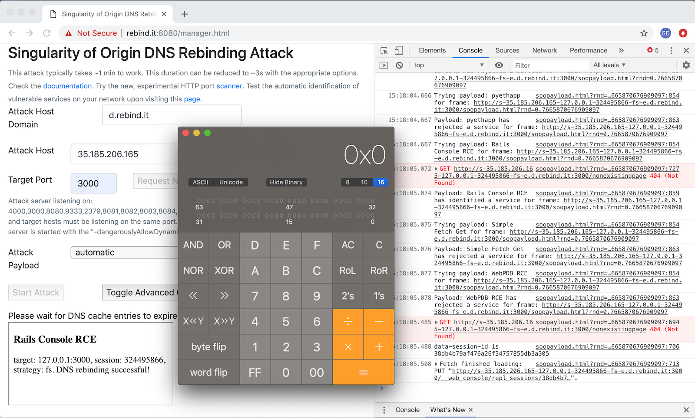
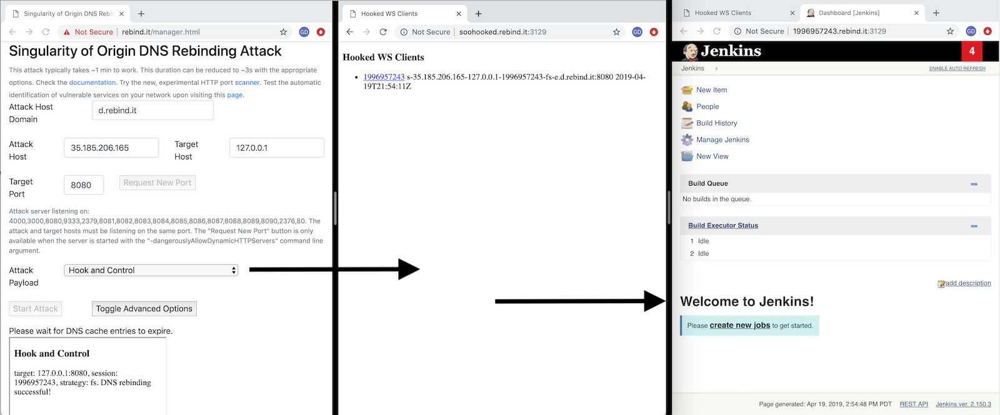
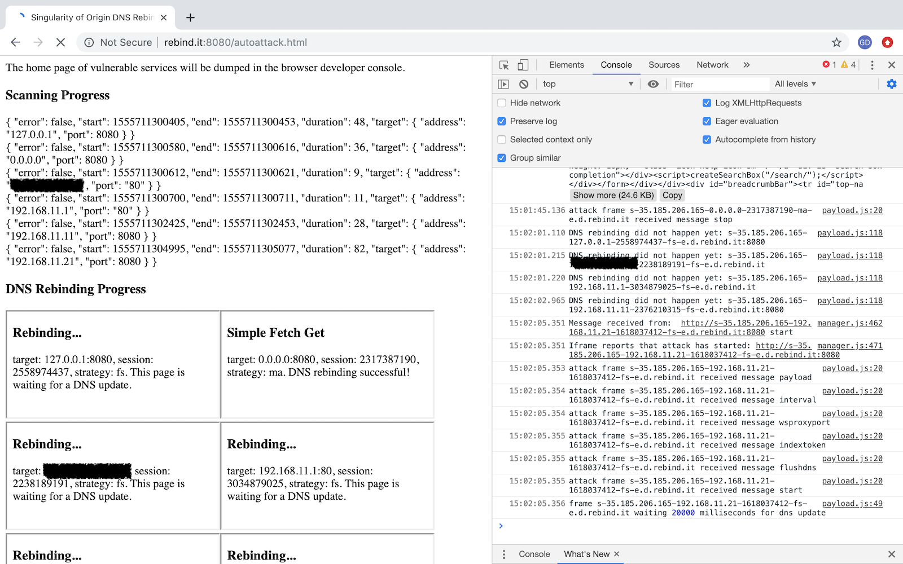

# Singularity of Origin

NEW! The WebRTC leak, which permitted to obtain the internal IP address of a target machine has been fixed in recent version of Google Chrome and Apple Safari. It still works on Firefox.
NEW! Check out our [DEF CON 27 video](https://youtu.be/y9-0lICNjOQ) and BSidesLV presentation at [State of DNS Rebinding: Attack & Prevention Techniques and
the Singularity of Origin](https://bit.ly/Singularity_Defcon27)

`Singularity of Origin` is a tool to perform [DNS rebinding](https://en.wikipedia.org/wiki/DNS_rebinding) attacks.
It includes the necessary components to rebind the IP address of the attack server DNS name to the target machine's IP address and to serve attack payloads to exploit vulnerable software on the target machine. 

It also ships with sample payloads to exploit several vulnerable software versions, from the simple capture of a home page to performing remote code execution. It aims at providing a framework to facilitate the exploitation of software vulnerable to DNS rebinding attacks and to raise awareness on how they work and how to protect from them.

Detailed documentation is on the [wiki pages](https://github.com/nccgroup/singularity/wiki).

## Core Features

- Singularity provides a complete DNS rebinding attack delivery stack:
  - Custom **DNS server** to rebind DNS name and IP address
  - **HTTP server** (manager web interface) to serve HTML pages and JavaScript code to targets and to manage the attacks
  - Several **sample attack payloads**, ranging from grabbing the home page of a target application to performing remote code execution. These payloads can be easily adapted to perform new and custom attacks.
  - Supports DNS CNAME values in target specification in addition to IP addresses to evade DNS filtering solutions or to target internal resources for which the IP address is unknown.
- A simple, fast and efficient HTTP **port scanner** to identify vulnerable services.
- **Attack automation** allows to completely automate the scanning and exploitation of vulnerable services on a network.
- **Hook and Control** permits using victim web browsers as HTTP proxies to access internal network resources, to interactively explore and exploit otherwise inaccessible applications with your own browser.

### Singularity Manager Interface

### Hook and Control a Vulnerable Application on Localhost or Other Hosts

### Automate the Scan and Compromise of All Vulnerables Applications

## Usage

Setting up Singularity requires a DNS domain name where you can edit your own
DNS records for your domain and a Linux server to run it.
Please see the [setup singularity](https://github.com/nccgroup/singularity/wiki/Setup-and-Installation) wiki page for detailed instructions.

The documentation is on the [wiki pages](https://github.com/nccgroup/singularity/wiki).
Here are a few pointers to start:

- What are [DNS Rebinding Attacks](https://github.com/nccgroup/singularity/wiki/How-Do-DNS-Rebinding-Attacks-Work%3F)?
- [Preventing DNS Rebinding Attacks](https://github.com/nccgroup/singularity/wiki/Preventing-DNS-Rebinding-Attacks)
- [Setup and Installation](https://github.com/nccgroup/singularity/wiki/Setup-and-Installation)
- Description of existing [Payloads](https://github.com/nccgroup/singularity/wiki/Payloads) and how to write your own

A test instance is available for demo purposes at http://rebind.it:8080/manager.html.

## Speed

Singularity has been tested to work with the following browsers in optimal conditions in under **3 seconds**:

| Browser  | Operating System | Time to Exploit | Rebinding Strategy | Fetch Interval | Target Specification |
| --- | --- | --- | --- | ---| ---| 
| Chrome  | Windows 10 | ~3s | `Multiple answers (fast)` | 1s | 127.0.0.1 |
| Edge | Windows 10 |  ~3s | `Multiple answers (fast)` | 1s |127.0.0.1 |
| Firefox | Windows 10 | ~3s | `Multiple answers (fast)` | 1s | 127.0.0.1 |
| Chromium | Ubuntu | ~3s | `Multiple answers (fast)` | 1s | 0.0.0.0 |
| Firefox | Ubuntu | ~3s | `Multiple answers (fast)` | 1s | 0.0.0.0 |
| Chrome | macOS | ~3s | `Multiple answers (fast)` | 1s |0.0.0.0 |
| Firefox | macOS |  ~3s | `Multiple answers (fast)` | 1s |0.0.0.0 |
| Safari | macOS |  ~3s | `Multiple answers (fast)` | 1s |0.0.0.0 |

### Payloads Description
Singularity supports the following attack payloads:

* **Basic fetch request** (`simple-fetch-get.js`): This sample payload
  makes a GET request to the root directory ('/') and shows the server response
  using the `fetch` API.
  The goal of this payload is to function as example request to make additional
  contributions as easy as possible.
* **automatic**: This payload automatically attempts to detect known services and exploit them using other payloads listed in this section or that were developed and added to Singularity by users.
* **Chrome DevTools RCE** (`exposed-chrome-devtools.js`): This payload
  demonstrates a remote code execution (RCE) vulnerability in Microsoft VS Code fixed in version 1.19.3.
  This payload can be adapted to exploit any software that exposes Chrome Dev Tools on `localhost`.
* **Etcd k/v dump** (`etcd.js`): This payload retrieves the keys and values from
  the [etcd](https://github.com/coreos/etcd) key-value store.
* **pyethapp** (`pyethapp.js`): Exploits the Python implementation of the 
  Ethereum client [Pyethapp](https://github.com/ethereum/pyethapp) to get the
  list of owned eth addresses and retrieve the balance of the first eth address.
* **Rails Console RCE** (`rails-console-rce.js`): Performs a remote code
  execution (RCE) attack on the [Rails Web Console](https://github.com/rails/web-console).
* **AWS Metadata Exfil** (`aws-metadata-exfil.js`): Forces a headless browser to exfiltrate AWS metadata 
  including private keys to a given host. Check the payload contents for additional details on how to setup 
  the attack.
* **Duplicati RCE** (`duplicati-rce.js`): This payload exploits the
  Duplicati backup client and performs a remote code execution (RCE) attack.
  For this attack to work, parameter `targetURL` in file `payload-duplicati-rce.html` must be updated to 
  point to a valid Duplicati backup containing the actual RCE payload, 
  a shell script.
* **WebPDB** (`webpdb.js`): A generic RCE payload to exploit `PDB`, 
  a python debugger exposed via websockets.
* **Hook and Control** (`hook-and-control.js`): Hijack target browsers and use them to access inaccessible resources from your own browser or other HTTP clients. You can retrieve the list of hooked browsers on the "soohooked" sub-domain of the Singularity manager host on port 3129 by default e.g. http://soohooked.rebinder.your.domain:3129/. To authenticate, submit the secret value dumped to the console by the Singularity server at startup.
* **Jenkins Script Console** (`jenkins-script-console.js`): This payload exploits the
  [Jenkins Script Console](https://wiki.jenkins.io/display/JENKINS/Jenkins+Script+Console)
  and displays the stored credentials.
* **Docker API** (`docker-api.js`): This payload exploits the
  [Docker API](https://docs.docker.com/engine/api/latest/)
  and displays the `/etc/shadow` file of the Docker host.

